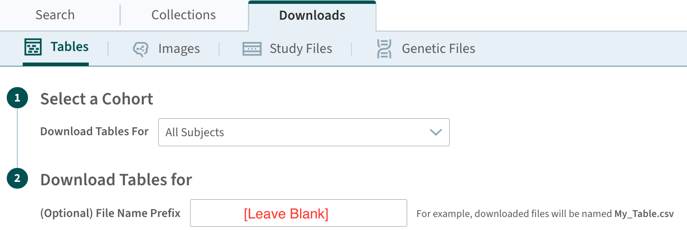

# Building ADNIMERGE2 from csv files 

To build an R data package from source `.csv` files with similar workflow: 

## Create R Package Project 

Clone the [https://github.com/atri-biostats/ADNIMERGE2](https://github.com/atri-biostats/ADNIMERGE2) repository. This will create the following directories:
   
   + [`data-raw`](https://github.com/atri-biostats/ADNIMERGE2/tree/main/data-raw): to store raw-data
   
   + [`R`](https://github.com/atri-biostats/ADNIMERGE2/tree/main/R): to store package-specific defined function that includes utils function
   
   + [`man`](https://github.com/atri-biostats/ADNIMERGE2/tree/main/R): to store roxygen2 documentation of functions/data in the package
   
   + [`vignettes`](https://github.com/atri-biostats/ADNIMERGE2/tree/main/vignettes): to store guidance documents/articles about the package if necessary
   
   + [`tests`](https://github.com/atri-biostats/ADNIMERGE2/tree/main/tests): to store package related test and retest scripts and will be checked during package building
   
   + [`inst`](https://github.com/atri-biostats/ADNIMERGE2/tree/main/inst): to store any files that will not be exported to the package, and that will be stored as system file including any external data that is not in R data format (i.e., `.rda`/`.Rdata`) 
   
   + [`tools`](https://github.com/atri-biostats/ADNIMERGE2/tree/main/tools): to store auxiliary files that needed during package configuration
   
Or create an R package project locally and add a package metadata into the local project directory: 
 
  * The package working directory can be created using [usethis::create_package](https://usethis.r-lib.org/reference/create_package.html) function. 
  
  * The package metadata file such as `DESCRIPTION` file similar to [this](https://github.com/atri-biostats/ADNIMERGE2/blob/main/DESCRIPTION) can be created using [usethis::use_description](https://usethis.r-lib.org/reference/use_description.html) function.
  
  * Copy all pre-defined scripts/functions as necessary from the [ADNIMERGE2 github repository](https://github.com/atri-biostats/ADNIMERGE2) with the same file path to the local package directory.

## Download the ADNI Study Data

Download the ADNI study data from the data-shared platform at [https://adni.loni.usc.edu/data-samples/adni-data/](https://adni.loni.usc.edu/data-samples/adni-data/) either in `*.zip` or `*.csv` file format, and store the files in [`./data-raw`](https://github.com/atri-biostats/ADNIMERGE2/tree/main/data-raw) directory
   
   + Required to download a data dictionary `*.csv` file
   
   + It is recommended to download files from the data-sharing platform on the same date. If the data is download from `Analysis Ready Cohort (ARC) Build`, it is recommended to download the file without adding any prefix to the file name as highlighted in the following figure.

 

### Required ADNI Study Data

A data dictionary file is required to build a package similar to `ADNIMERGE2` R data package. To replicate exactly the `ADNIMERGE2` R package, please refer to [`./inst/dataset-list.R`](https://github.com/atri-biostats/ADNIMERGE2/blob/package_build/inst/dataset-list.R) for the list of minimum required datasets.

## Build Package 

Run `source('tools/build.R')` to prepare dataset, generate documentations and build R package. More details about the main procedures in [`build.R`](https://github.com/atri-biostats/ADNIMERGE2/tree/main//tools/build.R) script are presented as follows: 

+ Data preparation: 
    
  - [`./data-raw/data-prep.R`](https://github.com/atri-biostats/ADNIMERGE2/tree/main/data-raw/data-prep.R): 
         
     + To store all dataset in *`./data`* directory using [`usethis::use_data()`](https://usethis.r-lib.org/reference/use_data.html)
         
     + Some additional data preparation, please see  [here](https://github.com/atri-biostats/ADNIMERGE2/tree/main/data-raw/data_prep.R) for more information. 
         
     + Required to specify two input arguments:  data download date (`DATA_DOWNLOADED_DATE`) in `YYYY-MM-DD` format and a Boolean value to update any existing data dictionary file (`UPDATE_DATADIC`)
     
  - [`./data-raw/data-prep-recode.R`](https://github.com/atri-biostats/ADNIMERGE2/tree/main/data-raw/data_prep_recode.R): 
         
     + To map numerically coded values of a dataset based on existing data dictionary as necessary
         
     + Required to specify indicator argument regarding whether to use an updated data dictionary (`USE_UPDATED_DATADIC`) if the data dictionary was updated in previous step
  
  - [`./data-raw/data-prep-category-pkgdown.R`](https://github.com/atri-biostats/ADNIMERGE2/tree/main/data-raw/data-prep-category-pkgdown.R): 
   
       + To create dataset category based on file path, file name or file content
    
       + Useful for data documentation and organizing dataset list in the [Reference](https://atri-biostats.github.io/ADNIMERGE2/reference/index.html) section of a package website that will be created using [pkgdown](https://pkgdown.r-lib.org/) R package.
       
  - [`./tools/generate-derived-data.R`](https://github.com/atri-biostats/ADNIMERGE2/tree/main/tools/generate-derived-data.R):  
      
      + To generate some derived dataset based on files in the [`vignettes`](https://github.com/atri-biostats/ADNIMERGE2/tree/main/vignettes) directory
         
      + Required to specify the name of derived dataset (`DERIVED_DATASET_LIST`) as an input argument
      
      + **NOTE:** At this moment, Preclinical Alzheimer Cognitive Composite (PACC) scores derived data will only be created internally due to not all required raw-input data are available at the data-sharing platform. Please refer to [ADNIMERGE2-PACC](https://atri-biostats.github.io/ADNIMERGE2/articles/ADNIMERGE2-PACC.html#import-raw-datasets) and [`./tools/generate-pacc-input-data.R`](https://github.com/atri-biostats/ADNIMERGE2/blob/main/tools/generate-pacc-input-data.R) for more information. 
       
          * We suggest to set the `INCLUDE_PACC_DERIVED_DATA` value to `FALSE` for not generating PACC scores data. 
          
          * Moreover, [`vignettes-yaml.R`](https://github.com/atri-biostats/ADNIMERGE2/blob/main/tools/vignettes-yaml.R) script will allows to change the default parameter yaml value related to PACC in package vignettes.
    
+ Generate data-related documentations:
    
   - To create roxygen2 documentation for the available datasets in the [`./data`](https://github.com/atri-biostats/ADNIMERGE2/tree/main/data) directory. 
   
   - [`./tools/document.R`](https://github.com/atri-biostats/ADNIMERGE2/tree/main/tools/document.R):
        
      + To generate documentations for both the raw data and the derived data based on the actual data values, and data dictionary
        
      + Required two input arguments: indicator of whether to use the updated data dictionary (`USE_UPDATED_DATADIC`) if it is existed, and name of derived dataset list (`DERIVED_DATASET_LIST`).
          
+ Build the data package: using [devtools R package](https://devtools.r-lib.org/)

# References

“Alzheimer’s Disease Neuroimaging Initiative — Adni.loni.usc.edu.” <https://adni.loni.usc.edu/>.

Wickham, Hadley, and Jennifer Bryan. “R Packages (2e) — r-Pkgs.org.” <https://r-pkgs.org/>.

