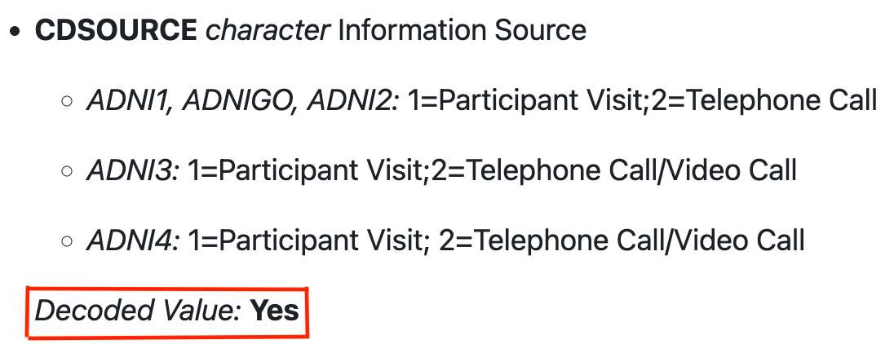

```{r setup, include = FALSE}
library(knitr)
knitr::opts_chunk$set(
  collapse = TRUE,
  fig.width = 5,
  fig.height = 4,
  comment = "#>",
  class.source = "fold-show"
)
# Package Versions
pkgName <- "ADNIMERGE2"
pkgFilename <- paste0("ADNIMERGE2_", packageVersion("ADNIMERGE2"), ".tar.gz")
```

# Overview 

The main goal of developing the Alzheimer's Disease Neuroimaging Initiative (ADNI) study R data package, *``r pkgName``*, is to grant easy access of the study data, which is being collected over two decades, for any researchers and/or data analyst who are interested to learn more about the study and conduct data analysis using the [R](https://www.r-project.org/) software. 

# Package Source

The *``r pkgName``* R package will be available on the data-sharing platform at [LONI website](https://adni.loni.usc.edu/). To get access the package, it is required to submit an online application via LONI website and acceptance of the ADNI Data Use Agreement. Please visit at <https://adni.loni.usc.edu/data-samples/adni-data/#AccessData> to learn more about the application submission process and ADNI Data Use Agreement.

# Installation

To install the package locally, run ``r paste0("install.packages(\"path/to/", pkgFilename, "\", repos = NULL, type = \"source\")")``.

# Package Usage 

```{r study-pkg}
library(ADNIMERGE2)
```

## Package Source Data Date 

The `r pkgName` package contains a data stamped date of which the raw data is downloaded from the data-sharing platform. For instance, the current package contains data that downloaded from the data-sharing platform as of `r ADNIMERGE2::DATA_DOWNLOADED_DATE`. To get the data stamped date:

```{r data-date}
# Data source downloaded date
ADNIMERGE2::DATA_DOWNLOADED_DATE
```

## Data Dictionary

A separate data dictionary file for both raw and derived datasets is included in the package. 

* *Raw Dataset: * Defined as all the study data that are available on the data-sharing platform.

* *Derived Dataset: * Defined as data that are generated during this package building. Please refer to the package vignettes to learn more how these data are generated.

```{r raw-data-dict}
# Data dictionary for raw data
head(ADNIMERGE2::DATADIC, 6)
```

```{r derived-data-dict}
# Data dictionary for derived data
head(ADNIMERGE2::DERIVED_DATADIC, 6)
```

```{r derived-data-dict2}
# Data dictionary for derived data based on R6-class object
ADNIMERGE2::METACORES
```

## Coded Values

Majority of the study raw data contains variable with numerically coded values. As a result, these variable values are mapped based on the data dictionary with corresponding study phase-specific mapping values. The variables which values are mapped accordingly have a *`Decoded Value: `*` `**`Yes`** tag in data documentations. For instance, `CDSOURCE` variable in the [``r "ADNIMERGE2::CDR"``]("../reference/CDR.html") have such tags as shown in Figure below within the red box. 



It is recommended to verify the values of numerically coded variables that are not mapped/decoded using the data dictionary file either in this package [``r "ADNIMERGE2::DATADIC"``]("../reference/DATADIC.html") or from the data-sharing platform.

To get all variables with code values: 

```{r libraries, echo=TRUE, message=FALSE, warning=FALSE}
library(tidyverse)
```

```{r codes-all}
# Get variable code values for all available data based on the DATADIC
data_dict_codes <- get_factor_levels_datadict(
  .datadic = ADNIMERGE2::DATADIC,
  tbl_name = NULL,
  nested_value = FALSE
)

class(data_dict_codes)

data_dict_codes %>%
  datadict_as_tibble() %>%
  relocate(prefix, suffix) %>%
  head()
```

## Missing Values

Furthermore, *`-4`* value in majority of the ADNI study phases and *`-1`* values in the *`ADNI1`* study phase were be considered as a missing value. Therefore, these values are converted into a missing character value `NA` in the package.


*NOTE: * `ℹ No variable that contains this value "-4"` message in the following two r chunks tells us there are no variables with the specified values in the [``r "ADNIMERGE2::DXSUM"``]("../reference/DXSUM.html") dataset since these values are already converted into missing value prior to the package build [here](https://github.com/atri-biostats/ADNIMERGE2/tree/main/data-raw/data-prep.R). 

```{r replace-missing-values-4}
# Convert "-4" into missing value
convert_to_missing_value(
  .data = ADNIMERGE2::DXSUM,
  col_name = colnames(ADNIMERGE2::DXSUM),
  value = "-4",
  missing_char = NA,
  phase = adni_phase()
) %>%
  select(-PTID) %>%
  head()
```

```{r replace-missing-values-1}
# Convert "-1" into missing value in ADNI1 phase only
convert_to_missing_value(
  .data = ADNIMERGE2::DXSUM,
  col_name = NULL,
  value = "-1",
  missing_char = NA,
  phase = "ADNI1"
) %>%
  select(-PTID) %>%
  head()
```

## Derived Datasets 

As part of the study data R package development, some derived datasets are created using the [PHARMAVERSE](https://pharmaverse.org/) workflow for illustration purpose. Detailed procedures of how these datasets are generated can be found in the following package vignettes:

* [ADNIMERGE2-Derived-Data](vignette(topic = "ADNIMERGE2-Derived-Data", package = "ADNIMERGE2")): Includes standardized derived datasets

* [ADNIMERGE2-Analysis-Meta-Specs](vignette(topic = "ADNIMERGE2-Analysis-Meta-Specs", package = "ADNIMERGE2")l): Includes a metadata specification that is used for generating the derived analysis ready datasets.

* [ADNIMERGE2-Analysis-Data](vignette(topic = "ADNIMERGE2-Analysis-Data", package = "ADNIMERGE2")l): Includes derived analysis ready datasets based on the metadata specifications and derived datasets.

**NOTE: ** 

* *It is recommended to learn more about how these data are generated and the corresponding raw data source prior using those derived data in any analysis.*

* *Some of the derived datasets in the package may not be fully complied with the [CDISC](https://www.cdisc.org/) standardization, and those data are generated for illustration purpose.*

## Articles 

There are few articles included in the package vignettes to demonstrate how to use the study data R package for creating simple summaries or analysis results.

* [Enrollment Summaries](): Includes enrollment summary by calender month, enrolled subject demographic/characteristics summary by study phases and baseline diagnostics status (Cognitive Normal (CN), Mild Cognitive Impairment (MCI) and Dementia (DEM)).

* [Longitudinal Clinical Cognitive Outcome Summaries](): Currently, includes summary of the ADAS Cognitive Behavior assessment item-13 total score (ADAS-cog) overtime across the baseline diagnostics status.

**NOTE: ** *The analysis results that presented in the package vignettes are not pre-planned and only included for illustration purpose.* 
